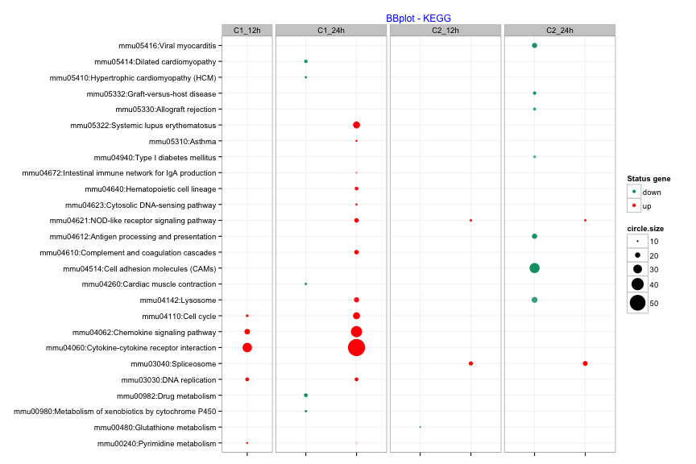
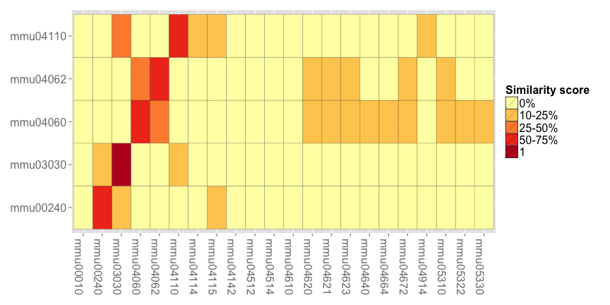

<!--
%\VignetteEngine{knitr::knitr}
%\VignetteIndexEntry{An Introduction to the BACA package}
-->

Title: BACA: Bubble chArt to Compare Annotations by using DAVID

Author: "Vittorio Fortino and Dario Greco"

========================================================

In some cases you have different, large lists of genes and you would like to perform several enrichment analysis and graphically compare the corresponding results. This can be done using the R package BACA. 

BACA provides three R functions: **DAVIDSearch**, **BBplot** and **Jplot**. 

DAVIDSearch is a user-friendly R function that wraps the code necessary to use the different types of functional annotations available in DAVID knowledgebase. It uses the R package RDAVIDWebService to query DAVID and wrap the results into R objects namely.RDAVIDWebService is a versatile interface to access DAVID analysis straight from R without the need of ad hoc parsing queried reports. It requires a registered DAVID user. For more details please visit http://david.abcc.ncifcrf.gov/content.jsp?file=WS.html. 

DAVIDSearch() accepts in input different lists of up-/down-regulated genes, the email of a given registered DAVID users, the type of gene ID, the type of list (Gene or Background), the EASE enrichment score, the functional type of annotation and the specie to use (see DAVID for more details). After querying DAVID web services (http://david.abcc.ncifcrf.gov/webservice), it outputs a list of DAVIDFunctionalAnnotationChart objects, one for each specified list of genes.  

 - DAVIDsearch <inputs>
  
    - **gene.lists**, indicate the gene lists of interest. To compare the enrichment of differential genes specify separately the up- and down- regulated genes.
    
    - **david.user**, indicate the email of a given registered DAVID; it is necessary to use the DAVID webservice.
    
    - **idType Character**, specify the type of submitted id (default value is "AFFYMETRIX_3PRIME_IVT_ID").
    
    - **listType**, specify type of list (defaul value is "Gene"). 
    
    - **easeScore**, specify a threshold value for the EASE enrichment score (defaul value is 2).
    
    - **annotation**, category name to use in the functional annotation analysis (default value is "KEGG_PATHWAY"). 
    
    - **specie**, the specie (default value is "Homo sapiens").
    
BBplot is an R function that uses the DAVIDFunctionalAnnotationChart objects to build a chart that graphically compares functional annotations found by DAVID. This chart shows a grid where each row represents an enriched annotation and each column corresponds to a condition/treatment where that annotation was highlighted. While, each cell reports a bubble indicating the number of genes enriching the corresplonding annotation and the state of these genes in terms of down- and up-regulation (default setting: green = "down" - red = "up"). BBplot function can work with any kind of gene list of interest and not only with up/down regulated gene lists. Moreover, it allows users to compare the enrichment of differential genes for different subgroups.

- BBplot <inputs>

    - **list.david.obj**, specify the list of DAVIDFunctionalAnnotationChart objects. It should correspond to the DAVIDsearch output.
    
    - **max.pval**, indicate the cut-off to select the most significant annotations.

    - **min.ngenes**,  indicate the minimum number of genes associated with a given gene list to select the most significant annotations. 

    - **title**, indicate the plot title. 
    
    - **name.cond**, specify a name for each list of up-/down-regulated genes.

    - **labels**,  specify the names used to indicate the down- and up-regulated gene lists. 
    
    - **colors**,  specify the colors used to distinguish down- and up-regulated gene lists. The default value is c("#009E73", "red").
    
    - **cod.term**, indicate whether the code of the terms/annotions must be added.

BACA uses external packages and assumes that they are installed. Packages to install and load before to use BACA: **RDAVIDWebService** and **ggplot2**.

Examples.


```r
library(RDAVIDWebService)
library(ggplot2)
library(BACA)
```

The example will be carried out using artificial gene lists: **gene.lists.ex**. This data contains artifical up- and down-regulated gene lists corresponding to two time points of two different experimental conditions. 


```r
data(gene.lists.ex)
```

The str() function can be used to check the content of **gene.lists.ex**.


```r
str(gene.lists.ex)
```

```
## List of 8
##  $ dn_cond.1_12h: chr [1:66] "12876" "67717" "433904" "72185" ...
##  $ up_cond.1_12h: chr [1:369] "14537" "18971" "74424" "59126" ...
##  $ dn_cond.1_24h: chr [1:731] "17289" "12808" "59049" "99586" ...
##  $ up_cond.1_24h: chr [1:1157] "17159" "637515" "14113" "18226" ...
##  $ dn_cond.2_12h: chr [1:756] "23873" "70601" "74211" "621542" ...
##  $ up_cond.2_12h: chr [1:1170] "72026" "327958" "104009" "21841" ...
##  $ dn_cond.2_24h: chr [1:1537] "12616" "18769" "20112" "66343" ...
##  $ up_cond.2_24h: chr [1:1569] "664987" "26447" "114606" "67561" ...
```

The **gene.lists.ex** contains eight character vectors:

 1) Condition #1 - time point 12h (list of down-regulated genes).
 
 2) Condition #1 - time point 12h (list of up-regulated genes).
 
 3) Condition #1 - time point 24h (list of down-regulated genes).
 
 4) Condition #1 - time point 24h (list of up-regulated genes).
 
 5) Condition #2 - time point 12h (list of down-regulated genes).
 
 6) Condition #2 - time point 12h (list of up-regulated genes).
 
 7) Condition #2 - time point 24h (list of down-regulated genes).
 
 8) Condition #2 - time point 24h (list of up-regulated genes).
 

After loading the data, use **DAVIDsearch()** to query the DAVID knowledge base. It requires two main inputs: (1) the lists of up-/down-regulated gene sets and (2) the email of a given registered DAVID users (make sure you are registered at http://david.abcc.ncifcrf.gov/webservice/register.htm). Then other optional inputs can be specified.  


```r
# result.kegg <- DAVIDsearch(gene.lists.ex, david.user = "vittorio.fortino@ttl.fi", idType="ENTREZ_GENE_ID", annotation="KEGG_PATHWAY")
```

Note, DAVID will find the species associated to the submitted gene lists and DAVIDsearch function will print out the corresponding names. Therefore, if the user wants to select one species name, it can re-use DAVIDsearch() function indicating as "species" a different, found pecies name. 

The following code is usefult to get inforamtion about the possibile input values. Note, this code does not call any function in the R package BACA. 


```r
david.obj <- DAVIDWebService$new(email="vittorio.fortino@ttl.fi")
getAllAnnotationCategoryNames(david.obj)
```

```
##  [1] "BBID"                                
##  [2] "BIND"                                
##  [3] "BIOCARTA"                            
##  [4] "BLOCKS"                              
##  [5] "CGAP_EST_QUARTILE"                   
##  [6] "CGAP_SAGE_QUARTILE"                  
##  [7] "CHROMOSOME"                          
##  [8] "COG_NAME"                            
##  [9] "COG_ONTOLOGY"                        
## [10] "CYTOBAND"                            
## [11] "DIP"                                 
## [12] "EC_NUMBER"                           
## [13] "ENSEMBL_GENE_ID"                     
## [14] "ENTREZ_GENE_ID"                      
## [15] "ENTREZ_GENE_SUMMARY"                 
## [16] "GENETIC_ASSOCIATION_DB_DISEASE"      
## [17] "GENERIF_SUMMARY"                     
## [18] "GNF_U133A_QUARTILE"                  
## [19] "GENETIC_ASSOCIATION_DB_DISEASE_CLASS"
## [20] "GOTERM_BP_2"                         
## [21] "GOTERM_BP_1"                         
## [22] "GOTERM_BP_4"                         
## [23] "GOTERM_BP_3"                         
## [24] "GOTERM_BP_FAT"                       
## [25] "GOTERM_BP_5"                         
## [26] "GOTERM_CC_1"                         
## [27] "GOTERM_BP_ALL"                       
## [28] "GOTERM_CC_3"                         
## [29] "GOTERM_CC_2"                         
## [30] "GOTERM_CC_5"                         
## [31] "GOTERM_CC_4"                         
## [32] "GOTERM_MF_1"                         
## [33] "GOTERM_MF_2"                         
## [34] "GOTERM_CC_FAT"                       
## [35] "GOTERM_CC_ALL"                       
## [36] "GOTERM_MF_5"                         
## [37] "GOTERM_MF_FAT"                       
## [38] "GOTERM_MF_3"                         
## [39] "GOTERM_MF_4"                         
## [40] "HIV_INTERACTION_CATEGORY"            
## [41] "HIV_INTERACTION_PUBMED_ID"           
## [42] "GOTERM_MF_ALL"                       
## [43] "HIV_INTERACTION"                     
## [44] "KEGG_PATHWAY"                        
## [45] "HOMOLOGOUS_GENE"                     
## [46] "INTERPRO"                            
## [47] "OFFICIAL_GENE_SYMBOL"                
## [48] "NCICB_CAPATHWAY_INTERACTION"         
## [49] "MINT"                                
## [50] "PANTHER_MF_ALL"                      
## [51] "PANTHER_FAMILY"                      
## [52] "PANTHER_BP_ALL"                      
## [53] "OMIM_DISEASE"                        
## [54] "PFAM"                                
## [55] "PANTHER_SUBFAMILY"                   
## [56] "PANTHER_PATHWAY"                     
## [57] "PIR_SUPERFAMILY"                     
## [58] "PIR_SUMMARY"                         
## [59] "PIR_SEQ_FEATURE"                     
## [60] "PROSITE"                             
## [61] "PUBMED_ID"                           
## [62] "REACTOME_INTERACTION"                
## [63] "REACTOME_PATHWAY"                    
## [64] "PIR_TISSUE_SPECIFICITY"              
## [65] "PRINTS"                              
## [66] "PRODOM"                              
## [67] "PROFILE"                             
## [68] "SMART"                               
## [69] "SP_COMMENT"                          
## [70] "SP_COMMENT_TYPE"                     
## [71] "SP_PIR_KEYWORDS"                     
## [72] "SCOP_CLASS"                          
## [73] "SCOP_FAMILY"                         
## [74] "SCOP_FOLD"                           
## [75] "SCOP_SUPERFAMILY"                    
## [76] "UP_SEQ_FEATURE"                      
## [77] "UNIGENE_EST_QUARTILE"                
## [78] "ZFIN_ANATOMY"                        
## [79] "UP_TISSUE"                           
## [80] "TIGRFAMS"                            
## [81] "SSF"                                 
## [82] "UCSC_TFBS"
```

Returns all available annotation category names.


```r
getIdTypes(david.obj)
```

```
##  [1] "AFFYMETRIX_3PRIME_IVT_ID" "AFFYMETRIX_EXON_GENE_ID" 
##  [3] "AFFYMETRIX_SNP_ID"        "AGILENT_CHIP_ID"         
##  [5] "AGILENT_ID"               "AGILENT_OLIGO_ID"        
##  [7] "ENSEMBL_GENE_ID"          "ENSEMBL_TRANSCRIPT_ID"   
##  [9] "ENTREZ_GENE_ID"           "FLYBASE_GENE_ID"         
## [11] "FLYBASE_TRANSCRIPT_ID"    "GENBANK_ACCESSION"       
## [13] "GENOMIC_GI_ACCESSION"     "GENPEPT_ACCESSION"       
## [15] "ILLUMINA_ID"              "IPI_ID"                  
## [17] "MGI_ID"                   "PFAM_ID"                 
## [19] "PIR_ID"                   "PROTEIN_GI_ACCESSION"    
## [21] "REFSEQ_GENOMIC"           "REFSEQ_MRNA"             
## [23] "REFSEQ_PROTEIN"           "REFSEQ_RNA"              
## [25] "RGD_ID"                   "SGD_ID"                  
## [27] "TAIR_ID"                  "UCSC_GENE_ID"            
## [29] "UNIGENE"                  "UNIPROT_ACCESSION"       
## [31] "UNIPROT_ID"               "UNIREF100_ID"            
## [33] "WORMBASE_GENE_ID"         "WORMPEP_ID"              
## [35] "ZFIN_ID"
```

Returns all acceptable DAVID idTypes.

DAVIDSearch outputs a list of DAVIDFunctionalAnnotationChart objects, one for each specified list of genes. The DAVIDFunctionalAnnotationChart class is defined into the R package [RDAVIDWebService](http://www.bioconductor.org/packages/release/bioc/html/RDAVIDWebService.html), it represents the output of "Functional Annotation Chart" of DAVID.

Note, query to DAVID webserver can take a long time to execute. Therefore, BACA package provides the DAVIDFunctionalAnnotationChart objects obtained querying DAVID with the artificial gene lists in **gene.lists.ex**. 


```r
data(result.kegg)
```


After using DAVIDsearch, build the bubble plot using the **BBplot()** function.


```r
bbplot.kegg <- BBplot(result.kegg, max.pval = 0.05, min.ngenes = 10, 
                    name.com = c("Cond.1_12h","Cond.1_24h","Cond.2_12h","Cond.2_24h"), 
                    labels = c("down", "up"), colors = c("#009E73", "red"), 
                    title = "BBplot - KEGG")
```


```r
bbplot.kegg
```

 

Save the plot as a TIFF image using the ggsave function in the R package [ggplot2](http://cran.r-project.org/web/packages/ggplot2/index.html).


```r
ggsave("KEGG_terms.tiff", width=6, height=4, scale=2, dpi=200)
```

Finally, use the **Jplot()** function to build/plot pairwise comparisons between functional annotation charts.


```r
jplot.kegg <- Jplot(result.kegg[[4]], result.kegg[[2]], max.pval = 0.05, min.ngenes = 10, cod.term=1)
```


```r
jplot.kegg
```

 
